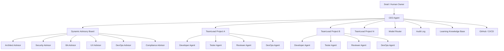
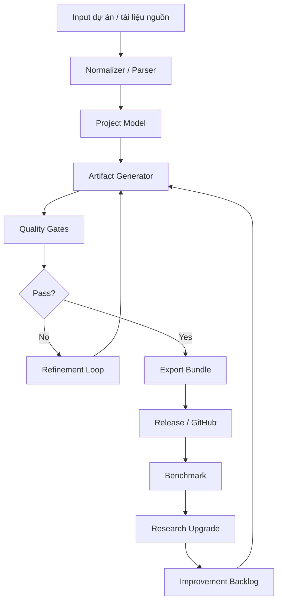
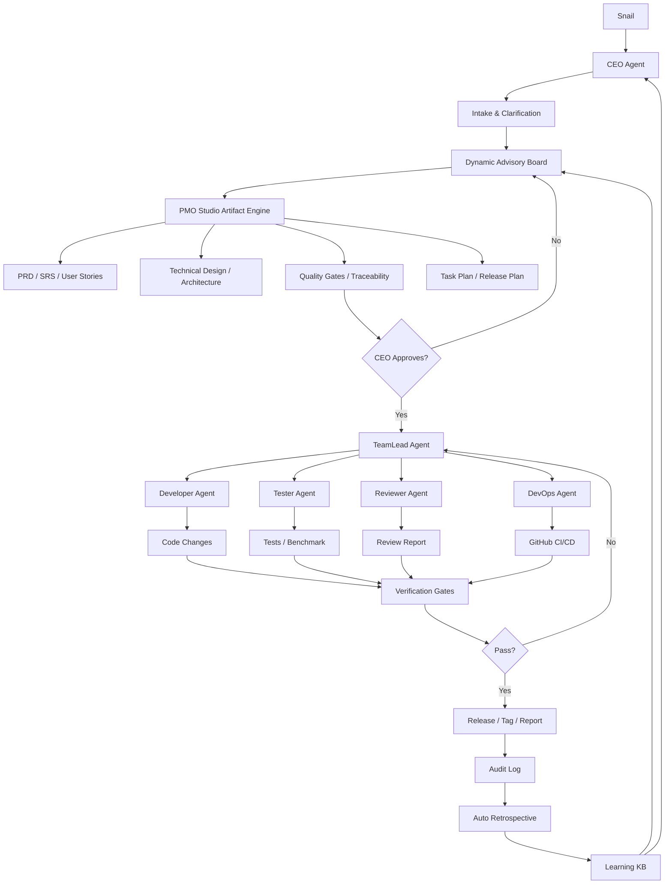
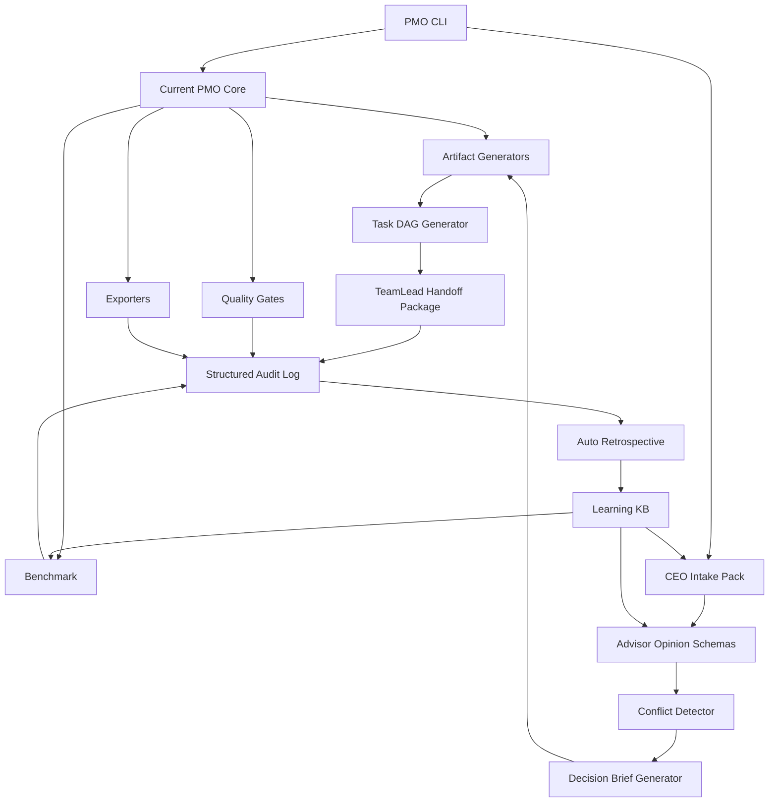

# Agentic Vibe Code Integration for PMO Studio

> Phân tích file “Xây dựng quy trình vibe code cho AI agent” và đề xuất cách kết hợp với luồng vận hành PMO Studio để phát triển thành một hệ thống xây dựng phần mềm tự chủ hơn.

Related source/spec docs:

- `docs/vibe-code-ai-agent-system-model.md` — conceptual source-of-truth từ file Snail gửi.
- `docs/vibe-code-pmo-studio-gap-analysis.md` — gap analysis, guardrails, và roadmap tích hợp PMO Studio.

## 1. Executive Summary

File Claude mô tả một mô hình phát triển phần mềm bằng AI Agent theo cấu trúc:

```text
Snail → CEO Agent → Dynamic Advisory Board → TeamLead per Project → Sub-agents → GitHub/CI/CD
```

Các điểm cốt lõi:

1. **CEO Agent** là trung tâm điều phối, portfolio manager, không chỉ là task orchestrator.
2. **Advisory Board** được chọn động theo từng task, thảo luận hybrid: parallel trước, discussion nếu có xung đột.
3. **TeamLead Agent** chịu trách nhiệm phát triển từng project, mỗi project có một TeamLead riêng.
4. **CEO có quyền can thiệp sâu** vào development khi cần, kể cả bypass TeamLead để nói trực tiếp với sub-agent.
5. **Verification Gates** nằm giữa các phase, không phase nào được skip.
6. **Audit Log + Learning Loop** là nguồn dữ liệu để hệ thống tự cải thiện.
7. **GitHub/CI/CD** là đích release tự động: tạo repo, PR, test, auto-merge khi pass.
8. **Snail chỉ bị hỏi khi blocker tuyệt đối**: credentials, quyết định nghiệp vụ không thể suy đoán.

PMO Studio hiện đã có nhiều thành phần của mô hình này:

```text
Product Core
Quality Gates
Benchmark Suite
Release Discipline
Research Loop
Docs/Memory/Roadmap
```

Điểm còn thiếu nếu muốn tiến lên cấp “AI software factory” là:

```text
CEO/TeamLead orchestration layer
Advisor council protocol
Project portfolio state
Task DAG / agent handoff protocol
Audit log chuẩn hóa cho mọi quyết định
Learning loop từ project retrospectives
```

---

## 2. Mô hình gốc trong file Claude

### 2.1 Kiến trúc nhiều tầng



### 2.2 Vai trò chính

#### Snail / Human Owner

- Giao yêu cầu cấp cao.
- Chỉ can thiệp khi có blocker tuyệt đối.
- Có quyền pause/abort/override toàn hệ thống.
- Review audit log và status board định kỳ.

#### CEO Agent

- Portfolio manager.
- Chọn advisor theo từng task.
- Ra quyết định cuối cùng.
- Quản lý nhiều dự án song song.
- Load đúng project context khi chuyển dự án.
- Có quyền can thiệp vào TeamLead/sub-agents khi cần.
- Là điểm giao tiếp duy nhất với Snail.

#### Dynamic Advisory Board

- Không cố định thành phần.
- CEO chọn advisor theo domain của task.
- Advisor chỉ tư vấn, không có quyền thực thi.
- Hybrid discussion:
  - Round 1: advisor phân tích song song.
  - Conflict Detector tìm bất đồng.
  - Nếu có xung đột: discussion round có giới hạn.
  - Nếu vẫn không consensus: CEO quyết định và log rationale.

#### TeamLead per Project

- Mỗi project có một TeamLead riêng.
- Nhận PRD/Tech Design từ CEO.
- Chia task, scaffold repo, điều phối developer/tester/reviewer/devops.
- Báo cáo CEO khi có blocker kỹ thuật hoặc cần quyết định.

#### Sub-agents

- Developer: viết code theo task nhỏ.
- Tester: sinh test, chạy test, phân tích failure.
- Reviewer: review security/performance/maintainability.
- DevOps: CI/CD, release, deployment.

---

## 3. Mô hình PMO Studio hiện tại

PMO Studio hiện đang vận hành như một product factory:



Các điểm mạnh đã có:

- Project model / artifact pipeline.
- Quality gates.
- Tests / benchmark.
- Release discipline.
- Research upgrade scanner.
- Docs/known limitations/architecture.
- GitHub repo và CI/release-oriented workflow.

Nhưng PMO Studio hiện chủ yếu là:

```text
AI-assisted artifact/product generator
```

Chưa hoàn toàn là:

```text
Multi-agent autonomous software development organization
```

---

## 4. Điểm giao nhau giữa hai mô hình

### 4.1 Mapping vai trò

| Claude vibe-code model | PMO Studio hiện tại | Khoảng trống |
|---|---|---|
| CEO Agent | SnailBot / human-driven orchestration | Cần formal CEO state + decision engine |
| Advisory Board | Research docs, review logic, benchmark rubrics | Cần advisor protocol và conflict handling |
| TeamLead per project | Manual agent execution / CLI workflow | Cần project runner + task DAG |
| Developer Agent | Generators / code edits by assistant | Cần coding sub-agent workflow chuẩn |
| Tester Agent | pytest, benchmark, negative checks | Đã mạnh, cần agent hóa hơn |
| Reviewer Agent | quality gates, docs review | Cần multi-perspective review |
| DevOps Agent | release docs, GitHub workflows | Cần automated PR/tag/release policy |
| Audit Log | HEARTBEAT, CHANGELOG, git log | Cần structured event log |
| Learning Loop | research upgrade + memory | Cần retrospective → learning KB |

### 4.2 PMO Studio là “Product Core” tốt cho CEO system

Trong mô hình vibe-code, CEO cần tạo ra các artifact trước khi TeamLead code:

```text
Idea → PRD → Tech Design → Task Plan → Test Plan → Release Plan
```

PMO Studio đã rất phù hợp để đảm nhiệm phần này:

```text
CEO Agent dùng PMO Studio làm artifact engine
```

Tức là PMO Studio không chỉ là project riêng, mà có thể trở thành **planning/documentation/quality subsystem** cho mọi project mới.

---

## 5. Mô hình kết hợp đề xuất



### Ý nghĩa

PMO Studio trở thành lớp trung gian giữa CEO và TeamLead:

```text
CEO không giao việc mơ hồ cho TeamLead.
CEO dùng PMO Studio để ép yêu cầu thành artifact có cấu trúc, traceable, testable.
```

TeamLead chỉ bắt đầu development khi PMO artifacts đã pass gate.

---

## 6. Quy trình kết hợp end-to-end

### Phase 0 — Request Intake

Input từ Snail:

```text
“Tôi cần xây phần mềm X…”
```

CEO parse thành:

```text
Project intent
Business goal
Constraints
Unknowns
Risk level
Required advisors
```

Gate 0:

```text
- Có đủ intent chưa?
- Có blocker credentials/business decision không?
- Có cần hỏi Snail ngay không?
```

### Phase 1 — Dynamic Advisory

CEO chọn advisor theo task:

```text
Architect
BA/Product
Security
UX
DevOps
Compliance
Domain Expert
```

Advisor phân tích song song:

```text
Option A
Option B
Risk
Trade-off
Recommendation
```

Conflict Detector phân loại:

```text
No conflict → CEO synthesize
Technical conflict → discussion round
Business conflict → CEO quyết hoặc hỏi Snail
Critical unknown → escalate Snail
```

Output:

```text
Decision Brief
Advisor Opinions
Conflict Resolution Log
```

### Phase 2 — PMO Artifact Generation

CEO đưa Decision Brief vào PMO Studio để sinh:

```text
PRD
SRS
User Stories
Acceptance Criteria
Architecture Outline
Test Plan
Release Checklist
Risk Register
```

Gate 2:

```text
- Requirement không vague
- User story đạt INVEST
- AC có Given/When/Then
- Requirement trace được về source/decision
- Test plan cover major flows
- Risk register có mitigation
```

### Phase 3 — Planning & Scaffolding

TeamLead nhận artifact đã pass gate.

TeamLead tạo:

```text
Repo
Project scaffold
Task DAG
Milestones
CI skeleton
Test skeleton
```

Gate 3:

```text
- Repo tạo thành công
- README có goal/setup/run/test
- CI chạy được
- Task DAG map về user stories
- verify_all.sh tồn tại
```

### Phase 4 — Development Loop

Mỗi task chạy qua loop:

```text
Task → Developer → Unit Test → Reviewer → Fix → Integration Test
```

Với LLM tối đa:

```text
Developer:
- Generate skeleton
- Implement từng function
- Self-review
- Refactor
- Docstring

Tester:
- Generate test cases
- Write tests
- Run tests
- Analyze failures

Reviewer:
- Security review
- Performance review
- Maintainability review
- Docs/API review
```

Gate 4:

```text
- compile pass
- unit tests pass
- integration tests pass
- security/maintainability review pass
- no unreviewed generated code
```

### Phase 5 — Release & Retrospective

DevOps Agent:

```text
Create PR
Run CI
Auto-merge if pass and policy allows
Tag release
Generate release notes
```

PMO Studio/CEO:

```text
Update CHANGELOG
Update docs/release.md
Generate project handoff
Run benchmark/regression
```

Auto retrospective:

```text
What failed?
Which advisor was accurate?
Which tests caught bugs?
Which decisions were reversed?
What reusable template/library emerged?
```

Output vào Learning KB.

---

## 7. Cách nâng cấp PMO Studio từ mô hình này

### Upgrade 1 — Thêm “CEO Intake Pack”

PMO Studio nên có khả năng nhận input thô và sinh CEO-ready intake:

```text
docs/templates/ceo-intake.md
pmo_studio/agents/intake.py
```

Output schema:

```json
{
  "project_intent": "...",
  "business_goal": "...",
  "known_constraints": [],
  "unknowns": [],
  "required_advisors": [],
  "escalation_needed": false,
  "escalation_questions": []
}
```

### Upgrade 2 — Advisor Opinion Schema

Chuẩn hóa output của advisor:

```json
{
  "advisor": "SecurityAdvisor",
  "position": "...",
  "recommendation": "...",
  "risks": [],
  "assumptions": [],
  "confidence": "medium",
  "must_discuss": []
}
```

PMO Studio có thể validate schema này.

### Upgrade 3 — Conflict Detector

Một module đọc các advisor opinions và phân loại:

```text
No conflict
Technical conflict
Business conflict
Security/compliance conflict
Missing information
```

Output:

```json
{
  "conflict_level": "none|low|medium|high",
  "conflict_topics": [],
  "requires_discussion_round": true,
  "requires_human_escalation": false
}
```

### Upgrade 4 — Decision Brief Generator

Sau Advisory Board, CEO cần artifact chính thức:

```text
Decision Brief
```

Nội dung:

```text
Context
Options considered
Selected approach
Rejected alternatives
Rationale
Risks
Success criteria
Verification plan
```

Đây là cầu nối giữa Advisory Board và PMO artifact generation.

### Upgrade 5 — Task DAG Generator

PMO Studio hiện mạnh về docs/artifacts. Bước tiếp theo là sinh task DAG:

```json
{
  "tasks": [
    {
      "id": "TASK-001",
      "title": "...",
      "depends_on": [],
      "maps_to_story": "US-001",
      "acceptance_tests": [],
      "owner_agent": "DeveloperAgent",
      "gate": "unit+review"
    }
  ]
}
```

TeamLead dùng DAG này để điều phối sub-agents.

### Upgrade 6 — Structured Audit Log

Hiện PMO Studio có changelog/docs/git log. Cần thêm event log chuẩn:

```jsonl
{"ts":"...","project":"...","actor":"CEO","event":"decision_made","input":"...","output":"...","rationale":"..."}
{"ts":"...","project":"...","actor":"TeamLead","event":"task_assigned","task":"TASK-001","agent":"Developer"}
{"ts":"...","project":"...","actor":"Tester","event":"test_failed","test":"...","reason":"..."}
```

Audit log phải trace được:

```text
Source request → advisor opinion → CEO decision → requirement → task → code → test → release
```

### Upgrade 7 — Auto Retrospective

Sau mỗi release, PMO Studio sinh retrospective:

```text
What shipped?
What broke?
Which gate caught what?
Which advisor was useful?
Which generated tests were weak?
What should become reusable template?
What should be added to benchmark suite?
```

Output:

```text
docs/retrospectives/YYYY-MM-DD-release-x.md
docs/learning/lessons-learned.md
```

### Upgrade 8 — Portfolio Status Board

Vì 1 CEO quản nhiều project, cần status board:

```json
{
  "projects": [
    {
      "name": "pmo-studio",
      "state": "development|blocked|released|research",
      "teamlead": "...",
      "priority": "normal",
      "current_phase": "Phase 4 Development",
      "blockers": [],
      "last_release": "v5.1.0"
    }
  ]
}
```

---

## 8. PMO Studio vNext proposed architecture



---

## 9. Các command/CLI nên có trong tương lai

Không nhất thiết làm ngay, nhưng nếu phát triển theo mô hình này, PMO Studio có thể có các command:

```bash
pmo-studio intake request.md --out project-intake.json
pmo-studio advise project-intake.json --advisors architect,security,ba --out advisor-opinions.json
pmo-studio detect-conflicts advisor-opinions.json --out conflict-report.json
pmo-studio decision advisor-opinions.json conflict-report.json --out decision-brief.md
pmo-studio generate-from-decision decision-brief.md --pack full
pmo-studio task-dag artifacts/ --out task-dag.json
pmo-studio teamlead-handoff task-dag.json artifacts/ --out handoff.md
pmo-studio audit summarize audit.jsonl --out audit-summary.md
pmo-studio retro audit.jsonl test-results/ --out docs/retrospectives/release.md
```

---

## 10. Quality Gates mới cần thêm

### Gate CEO-1 — Intake Completeness

```text
- Goal rõ
- Scope sơ bộ rõ
- Unknowns được liệt kê
- Escalation questions nếu cần
```

### Gate ADV-1 — Advisor Coverage

```text
- Advisor phù hợp domain
- Mỗi advisor có confidence
- Risks/assumptions rõ
- Không có opinion thiếu rationale
```

### Gate ADV-2 — Conflict Resolution

```text
- Conflict được phân loại
- Discussion round có giới hạn
- CEO decision có rationale
- Rejected alternatives được ghi lại
```

### Gate PMO-1 — Artifact Quality

```text
- PRD/SRS/User Stories/AC pass existing PMO gates
- Traceability đủ
- Test plan cover critical flows
```

### Gate TL-1 — TeamLead Handoff

```text
- Task DAG đầy đủ
- Mỗi task map về story/requirement
- Mỗi task có acceptance test
- Repo scaffold có verify_all.sh
```

### Gate REL-1 — Release Readiness

```text
- CI pass
- Benchmark không regression
- Docs/changelog updated
- Audit trail complete
- Retrospective generated
```

---

## 11. Rủi ro của mô hình vibe-code và cách PMO Studio giảm rủi ro

### Rủi ro 1 — CEO quyết sai nhưng tự tin

Giảm bằng:

```text
Advisor diversity
Conflict detector
Decision brief
Audit log
Human override
Benchmark feedback
```

### Rủi ro 2 — Multi-agent nói nhiều, không ship

Giảm bằng:

```text
Discussion round limit
CEO final decision
Task DAG
Release gate
Definition of Done
```

### Rủi ro 3 — Code sinh nhiều nhưng chất lượng thấp

Giảm bằng:

```text
Developer → Tester → Reviewer loop
verify_all.sh
benchmark
security/maintainability review
negative checks
```

### Rủi ro 4 — Context lẫn giữa nhiều dự án

Giảm bằng:

```text
Project namespace
Portfolio status board
Per-project TeamLead
Per-project audit log
```

### Rủi ro 5 — Hệ thống tự học sai

Giảm bằng:

```text
Learning KB có source-backed lessons
Retrospective ghi evidence
Human feedback có quyền override
Không tự sửa system policy từ learning loop
```

---

## 12. Lộ trình phát triển đề xuất cho PMO Studio

### Phase A — Documentation Integration

- Thêm tài liệu này vào docs.
- Link từ operating model blueprint.
- Định nghĩa PMO Studio vNext là planning/quality subsystem cho CEO-Agent software factory.

### Phase B — Schemas First

Thêm schema trước, chưa cần agent runtime:

```text
schemas/intake.schema.json
schemas/advisor-opinion.schema.json
schemas/conflict-report.schema.json
schemas/decision-brief.schema.json
schemas/task-dag.schema.json
schemas/audit-event.schema.json
```

### Phase C — CLI Dry-run Tools

Thêm các command tạo/validate artifact từ file input, chưa spawn agent thật:

```text
intake
detect-conflicts
decision
task-dag
audit summarize
retro
```

### Phase D — Benchmark Cases

Thêm benchmark cho workflow mới:

```text
evals/agentic-software-factory/simple-crud-app/
evals/agentic-software-factory/internal-approval-system/
evals/agentic-software-factory/ai-doc-generator/
```

### Phase E — Agent Runtime Adapter

Sau khi schemas/gates ổn mới tích hợp OpenClaw sessions/subagents:

```text
CEO session
Advisor subagents
TeamLead session
Developer/Tester/Reviewer subagents
```

### Phase F — GitHub Automation

Cuối cùng mới tự động hóa:

```text
repo creation
branch/PR
auto-merge policy
tag release
release notes
```

---

## 13. Kết luận

File Claude đưa ra mô hình tổ chức AI Agent rất tốt, nhưng ở tầng ý tưởng. PMO Studio lại đã có phần “hệ miễn dịch sản phẩm”: docs, gates, tests, benchmark, release, research.

Kết hợp hai thứ sẽ tạo thành mô hình mạnh hơn:

```text
Claude vibe-code model = tổ chức agent / operating structure
PMO Studio model = artifact engine / quality system / release discipline
```

Mô hình đích:

```text
Snail gives intent
→ CEO Agent turns intent into decisions
→ Advisory Board improves decisions
→ PMO Studio turns decisions into traceable artifacts and task DAG
→ TeamLead executes with sub-agents
→ Quality gates verify
→ GitHub releases
→ Audit/retro/research improves next project
```

Điểm quan trọng nhất: **đừng nhảy ngay vào code agent runtime**. Nên phát triển theo hướng schema + artifact + gate trước. Khi artifact protocol đã chặt, agent runtime chỉ là lớp thực thi phía trên.
