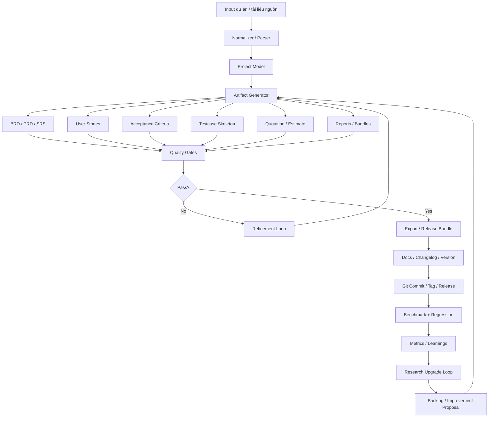
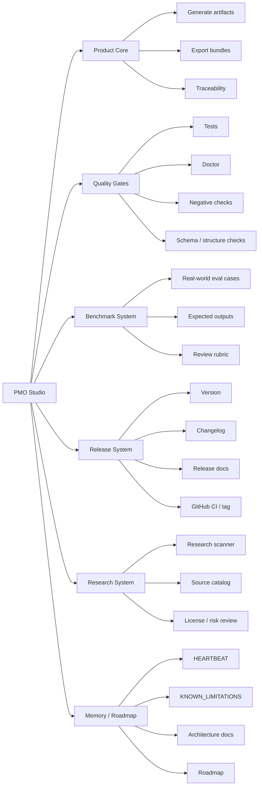
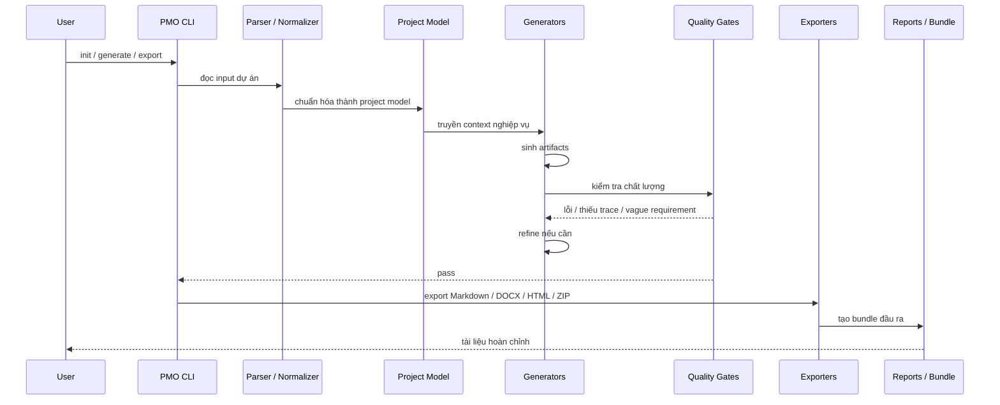
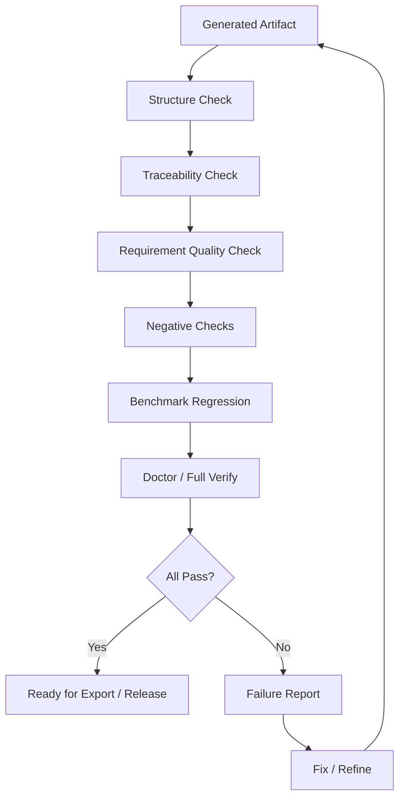
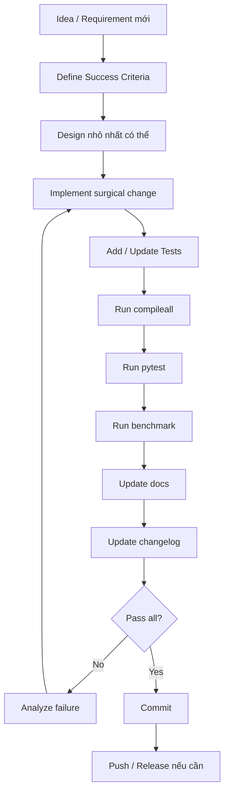
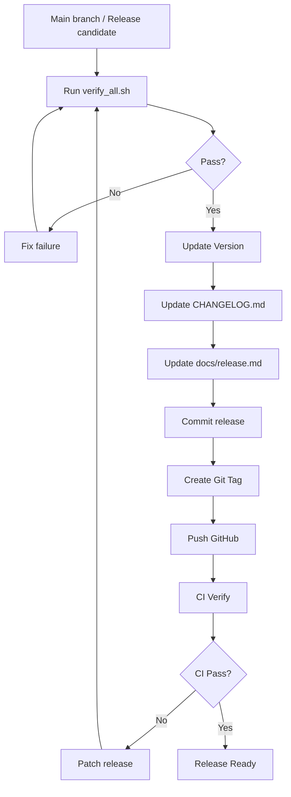
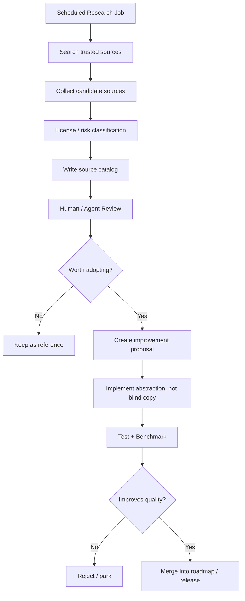
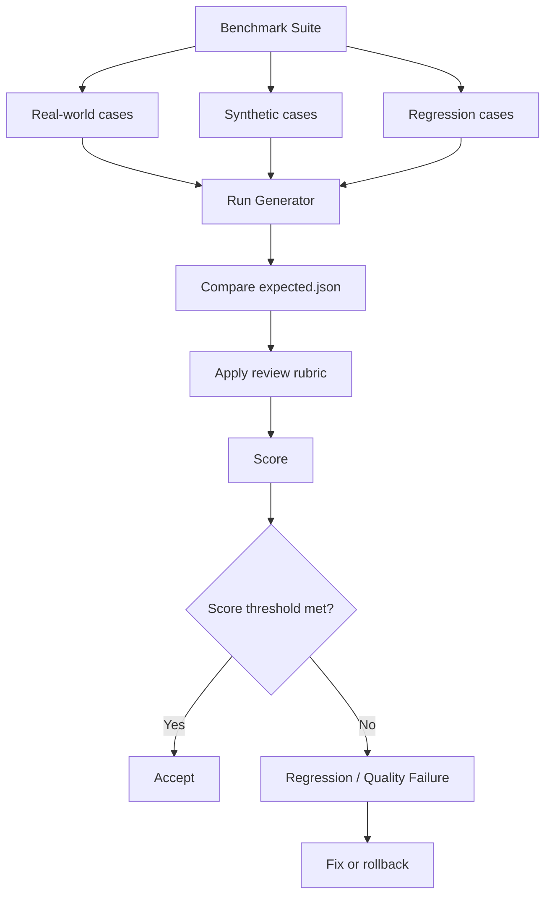
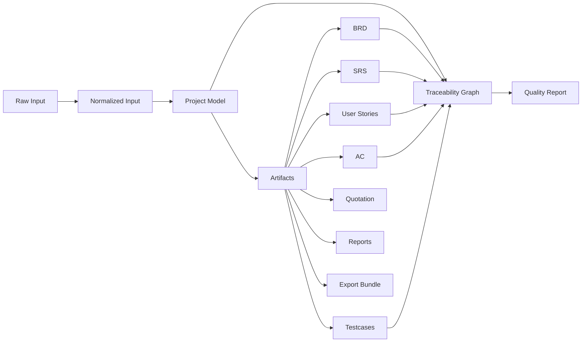
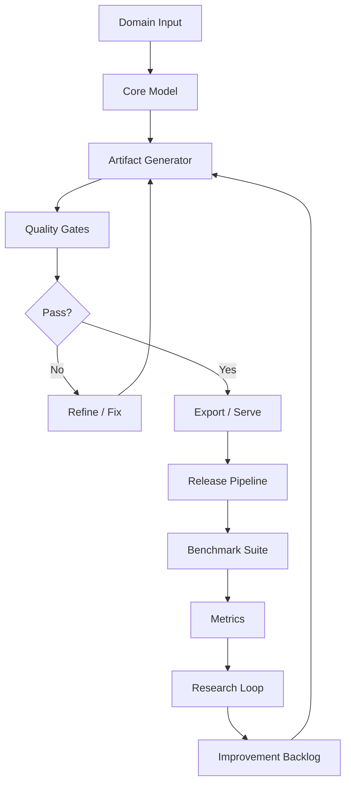

# PMO Studio Operating Model Blueprint

> Mô hình tham khảo để xây dựng các hệ thống có khả năng tự phát triển, tự kiểm tra, tự release và tự research.

## 1. Tóm tắt mô hình

PMO Studio không chỉ là một công cụ sinh tài liệu. Nó là một **AI-assisted product factory**: một nhà máy tạo artifact có quality gates, benchmark, release discipline, research loop và bộ nhớ vận hành.

Công thức tổng quát:

```text
Product Core
+ Quality Gates
+ Benchmark Cases
+ Release Train
+ Research Scanner
+ Memory / Roadmap
+ Agentic Development Loop
= Self-improving Product System
```

Nói ngắn gọn:

```text
Input → Generate → Validate → Refine → Export → Release → Benchmark → Research → Improve
```

---

## 2. Mô hình tổng thể



---

## 3. PMO Studio như một hệ thống 7 lớp



### 3.1 Product Core

Lõi sản phẩm phải trả lời rõ:

```text
User problem là gì?
Input chính là gì?
Output chính là gì?
Workflow chuẩn là gì?
Artifact nào là source of truth?
```

Với PMO Studio:

```text
Input tài liệu / mô tả dự án
→ Chuẩn hóa thành Project Model
→ Sinh artifact BA/PMO
→ Validate
→ Export
```

### 3.2 Quality Gates

PMO Studio không chỉ generate output, mà kiểm tra output qua nhiều tầng:

```text
Gate A — Syntax / structure
Gate B — Domain correctness
Gate C — Traceability
Gate D — Regression / benchmark
Gate E — Release readiness
```

### 3.3 Benchmark System

Benchmark là cơ chế chống “tự cải tiến ảo”. Mỗi thay đổi cần được đo bằng case thật hoặc regression case.

Cấu trúc chuẩn:

```text
evals/
└── real-world/
    └── case-name/
        ├── source.md
        ├── expected.json
        └── review-rubric.md
```

### 3.4 Release System

Release không chỉ là commit code. Release cần:

```text
CHANGELOG.md
Version bump
Release notes
Full verify
Git tag
CI pass
```

### 3.5 Research System

Research loop tìm nguồn cải tiến nhưng không copy mù quáng.

Nguyên tắc:

```text
Research → Catalog → License/Risk Review → Proposal → Implementation → Benchmark
```

### 3.6 Memory / Roadmap

Hệ thống cần có trí nhớ vận hành:

```text
HEARTBEAT.md
ROADMAP.md
KNOWN_LIMITATIONS.md
docs/architecture.md
docs/benchmarking.md
docs/release.md
docs/research/
```

### 3.7 Agentic Development Loop

AI/agent không tự ý làm loạn. Agent vận hành trong đường ray:

```text
Observe → Plan → Implement → Verify → Record → Release → Research
```

---

## 4. Luồng runtime khi user dùng PMO Studio



Luồng nghiệp vụ:

1. User đưa input.
2. PMO Studio chuẩn hóa input thành model nội bộ.
3. Generator sinh artifacts.
4. Quality Gates kiểm tra.
5. Nếu lỗi thì refine/fix.
6. Nếu pass thì export.
7. User nhận bundle.

---

## 5. Luồng tự kiểm tra chất lượng



Các kiểm tra chính:

### Structure Check

- File có đúng format không?
- Section có đủ không?
- JSON/Markdown có hợp lệ không?

### Traceability Check

- Requirement có map về source không?
- User story có map về feature không?
- Testcase có map về acceptance criteria không?

### Requirement Quality Check

- Có vague words không?
- Có compound requirement không?
- Có thiếu actor/action/outcome không?

### Negative Checks

- Input xấu có bị detect không?
- Case thiếu dữ liệu có fail đúng cách không?

### Benchmark Regression

- Case thật cũ có còn pass không?
- Score có giảm không?

### Doctor / Verify

- Môi trường, dependency, CLI, docs, release readiness có ổn không?

---

## 6. Luồng phát triển tính năng mới



Quy tắc:

```text
Không có feature nào được coi là xong nếu chưa có:
- success criteria
- test
- benchmark hoặc regression
- docs/changelog nếu ảnh hưởng user
```

---

## 7. Luồng release



Nút quan trọng:

```bash
scripts/verify_all.sh
```

Đây là cửa release. Không pass thì không release.

---

## 8. Luồng research tự động



Điểm quan trọng:

```text
Research không tự động sửa code.
Research chỉ tạo source catalog + proposal.
Implementation phải đi qua test/benchmark.
```

Đây là guardrail giúp hệ thống học từ bên ngoài nhưng không tự đưa rác/license risk vào codebase.

---

## 9. Luồng benchmark / regression



Benchmark là “trí nhớ chất lượng” của hệ thống. Nếu không có benchmark, hệ thống có thể thay đổi nhiều nhưng không biết mình tốt hơn hay tệ đi.

---

## 10. Mô hình data / artifact



Source of truth nên là:

```text
Project Model + Traceability Graph
```

Artifacts là output. Nếu artifacts sai, nên sửa model/generator/gate, không sửa tay output quá nhiều.

---

## 11. Mô hình folder vận hành

```text
pmo-studio/
├── pmo_studio/
│   ├── cli.py
│   ├── generators/
│   ├── exporters/
│   ├── quality/
│   ├── traceability/
│   ├── eval/
│   ├── metrics/
│   └── llm/
│
├── tests/
│   ├── test_*.py
│   └── test_product_hardening.py
│
├── evals/
│   └── real-world/
│       └── legal-ai-customer-style/
│           ├── source.md
│           ├── expected.json
│           └── review-rubric.md
│
├── scripts/
│   ├── verify_all.sh
│   ├── research_upgrade.py
│   └── smoke_*.sh
│
├── docs/
│   ├── architecture.md
│   ├── benchmarking.md
│   ├── product-hardening.md
│   ├── known-limitations.md
│   ├── release.md
│   └── research/
│       ├── source-catalog.md
│       └── source-catalog.json
│
├── CHANGELOG.md
├── README.md
├── Makefile
└── pyproject.toml
```

---

## 12. Maturity model

PMO Studio có thể được nhìn theo thang trưởng thành:

```text
Level 1 — Script generate tài liệu
Level 2 — CLI tool có cấu trúc
Level 3 — Product có tests/docs/export
Level 4 — Product có quality gates + benchmark
Level 5 — Product có release automation
Level 6 — Product có research loop
Level 7 — Self-improving product system
```

PMO Studio hiện ở khoảng:

```text
Level 6.5 / 7
```

Nó chưa hoàn toàn tự quyết định chiến lược sản phẩm, nhưng đã có đủ cơ chế để:

```text
- tự phát triển có kiểm soát
- tự kiểm tra
- tự benchmark
- tự chuẩn bị release
- tự research nguồn cải tiến
```

---

## 13. Template áp dụng cho hệ thống mới

Một hệ thống mới có thể copy mô hình này:



Folder chuẩn:

```text
new-system/
├── src/
├── tests/
├── evals/
├── scripts/
│   ├── verify_all.sh
│   └── research_upgrade.py
├── docs/
│   ├── architecture.md
│   ├── quality-gates.md
│   ├── benchmarking.md
│   ├── release.md
│   └── known-limitations.md
├── README.md
├── CHANGELOG.md
└── Makefile
```

Minimum viable version:

```text
README.md
ROADMAP.md
KNOWN_LIMITATIONS.md
src/
tests/
scripts/verify_all.sh
evals/real-world/case-001/
docs/architecture.md
```

---

## 14. Áp dụng sang các domain khác

### 14.1 Pentest system

```text
Input: scope/ROE + evidence
Core model: engagement model + asset/finding model
Output: findings, reports, remediation roadmap
Quality gates:
- finding phải có evidence
- severity phải có rationale
- report không được xuất nếu scope chưa confirmed
- PoC/exploit cần approval gate
Research loop:
- CVE/KEV intelligence
- new testing methodology
- detection/remediation references
```

### 14.2 BA / Product system

```text
Input: idea, transcript, website, source docs
Core model: product model + requirement graph
Output: PRD, SRS, user stories, AC, testcases
Quality gates:
- INVEST check
- vague requirement detection
- traceability requirement → story → testcase
Research loop:
- new templates
- industry benchmark
- best practice catalog
```

### 14.3 Sales / Proposal system

```text
Input: lead info, meeting notes, pricing table
Core model: customer need + solution map
Output: proposal, quotation, SoW
Quality gates:
- every price maps to line item
- assumptions explicit
- risk section present
- margin threshold valid
Research loop:
- competitor offers
- market pricing
- proposal templates
```

### 14.4 Legal / Contract system

```text
Input: contract, policy, clause library
Core model: clause/risk graph
Output: risk memo, redline suggestions, checklist
Quality gates:
- every risk maps to clause
- severity rationale present
- no unsupported legal claim
Research loop:
- regulation updates
- clause pattern updates
- jurisdiction-specific references
```

---

## 15. Nguyên tắc thiết kế quan trọng

### 15.1 Không để AI là source of truth

AI sinh output, nhưng source of truth phải là:

```text
Input
Core model
Traceability graph
Tests / benchmarks
```

### 15.2 Không research rồi copy mù

Research phải đi qua:

```text
source catalog
license review
risk review
implementation proposal
benchmark
```

### 15.3 Không release nếu verify fail

Release phải có một cửa kiểm tra duy nhất:

```bash
scripts/verify_all.sh
```

### 15.4 Không phát triển nếu không có benchmark

Mỗi cải tiến quan trọng cần ít nhất một case kiểm chứng.

### 15.5 Không giấu limitation

`KNOWN_LIMITATIONS.md` là tài liệu bắt buộc. Nó giúp hệ thống không overclaim.

---

## 16. Related extension: Agentic Vibe Code Model

Sau khi phân tích file `Xây dựng quy trình vibe code cho AI agent`, có thể mở rộng blueprint này thành mô hình **AI software factory** với các lớp:

```text
Snail → CEO Agent → Dynamic Advisory Board → PMO Studio Artifact Engine → TeamLead per Project → Developer/Tester/Reviewer/DevOps → GitHub/CI/CD
```

Tài liệu phân tích chi tiết nằm tại:

```text
docs/agentic-vibe-code-integration.md
```

Ý tưởng chính: PMO Studio nên trở thành **artifact engine + quality system** cho CEO-Agent workflow. CEO/Advisory Board ra quyết định; PMO Studio biến quyết định thành PRD/SRS/User Stories/Test Plan/Task DAG có traceability; TeamLead/sub-agents mới bắt đầu code khi artifact pass gates.

---

## 17. Kết luận

PMO Studio nên được xem là một mẫu thiết kế cho các hệ thống tự cải tiến có kiểm soát:

```text
Không phải AI generate document.
Mà là product factory có QA, benchmark, release train, R&D loop và memory.
```

Mô hình này đáng dùng lại cho các hệ thống sau vì nó cân bằng được 4 thứ:

```text
1. Tốc độ phát triển
2. Khả năng tự kiểm tra
3. Kỷ luật release
4. Khả năng học từ nguồn bên ngoài mà không mất kiểm soát
```

Nếu đóng gói thành template, tên đề xuất:

```text
autonomous-product-template
```

Mục tiêu của template:

```text
Clone một lần → có sẵn structure, verify_all, benchmark, docs, release checklist và research loop.
```
