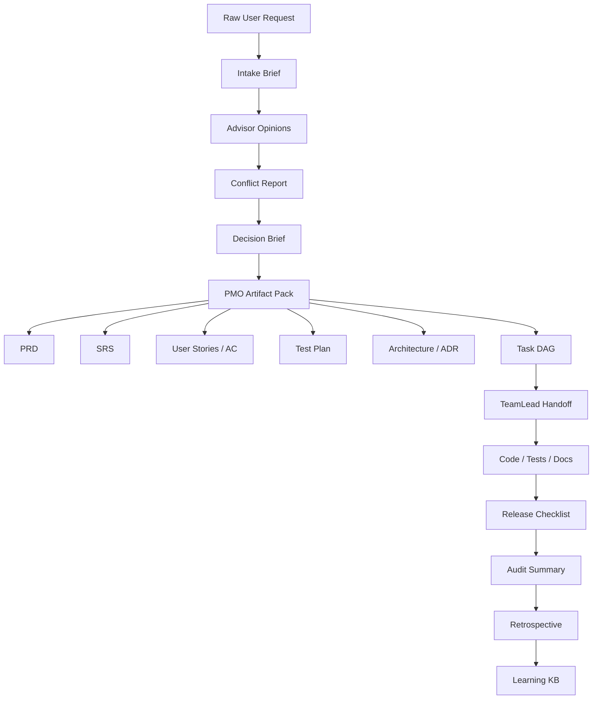

# Vibe Code AI Agent System × PMO Studio — Gap Analysis & Integration Plan

> Phân tích spec `vibe-code-ai-agent-system-model.md` như source-of-truth ý tưởng, đối chiếu với PMO Studio hiện tại, và đề xuất lộ trình tích hợp để phát triển hệ thống sau này.

## 1. Kết luận nhanh

Spec Vibe Code đã định nghĩa rất tốt phần **organization model**:

```text
Snail → CEO Agent → Advisory Board → TeamLead → Sub-agents → GitHub/CI/CD
```

PMO Studio hiện đã mạnh ở phần **product quality system**:

```text
Artifact generation → Quality gates → Benchmark → Release → Research loop
```

Cách kết hợp tốt nhất:

```text
Vibe Code Agent System = tầng điều phối / tổ chức phát triển
PMO Studio = tầng artifact, schema, gate, benchmark, release discipline
```

Nói cách khác:

```text
CEO/Advisory/TeamLead quyết định và điều phối.
PMO Studio chuẩn hóa quyết định thành artifact có thể kiểm tra.
Verification gates chặn trước khi agent runtime làm sai quá xa.
```

---

## 2. Những điểm mạnh của spec Vibe Code

### 2.1 Triết lý rõ

Spec chọn rõ hướng:

```text
maximum autonomy with full traceability
```

Điều này rất hợp với OpenClaw/SnailBot: ít hỏi user, nhưng mọi hành động phải audit được.

### 2.2 Phân tầng đúng

4 tầng là hợp lý:

```text
Human Interface
Decision Layer
Execution Layer
Infrastructure & Cross-cutting
```

Phân tầng này giúp tránh lẫn lộn giữa:

- ai ra quyết định,
- ai thực thi,
- ai kiểm tra,
- ai giữ state/audit/learning.

### 2.3 Có cơ chế kiểm soát autonomy

Spec không chỉ nói “agent tự code”, mà có:

- Verification Gates.
- Audit Log Service.
- Learning Loop.
- Escalation Filter.
- Context isolation.
- Ma trận quyền hạn.

Đây là điểm làm hệ thống có thể tiến tới production-grade, không phải demo agent toy.

### 2.4 TeamLead per project là quyết định đúng

1 CEO quản nhiều project, mỗi project 1 TeamLead, giúp:

- context isolation,
- priority arbitration,
- parallel project management,
- tránh CEO bị sa lầy vào task-level details.

---

## 3. Các gap/rủi ro cần xử lý trước implementation

### Gap 1 — “Audit log only” chưa đủ an toàn

Spec nói:

```text
Quality Control = Audit log only (trust + verify after), không block-before
```

Nhưng cùng lúc lại có Verification Gates. Hai ý này cần chỉnh lại cho chính xác hơn:

```text
Audit log = after-action traceability.
Verification gates = before-next-phase blocking control.
```

Khuyến nghị sửa wording:

```text
Quality Control = Gate-before-phase + Audit-after-action.
```

Nếu chỉ audit after mà auto-merge/full CI/CD thì rủi ro nghiệp vụ cao.

### Gap 2 — “Full CI/CD auto-merge” cần policy nhiều cấp

Không nên auto-merge mọi project chỉ vì test pass. Cần release policy:

```text
Level 0: docs/prototype only → auto-merge allowed
Level 1: internal tool non-critical → auto-merge after CI + gates
Level 2: touches credentials/data/integration → PR requires CEO approval
Level 3: production/finance/security → human approval required
```

### Gap 3 — Credential handling qua Telegram là rủi ro

Spec ví dụ Snail gửi credentials qua Telegram. Đây nên là anti-pattern.

Khuyến nghị:

```text
Telegram chỉ gửi instruction.
Secret nhập qua vault/secret file/one-time secure channel.
Agent chỉ nhận secret reference, không nhận secret value.
```

Ví dụ đúng:

```text
CEO asks: “Please put PMS OAuth credentials into /workspace/secrets/pms.env with chmod 600.”
Then agent verifies existence/keys, never prints values.
```

### Gap 4 — LLM call logging không nên lưu raw prompt/response chứa secrets

Audit Log Service đang ghi payload gồm prompt/response đầy đủ. Cần redaction policy:

```text
- Redact secrets before write.
- Hash sensitive values.
- Classify audit events by sensitivity.
- Store large prompts/responses as artifact references if needed.
```

### Gap 5 — Advisor trust score dễ tạo “confirmation bias”

Learning Loop tăng trust advisor theo kết quả cũ. Cần chống bias:

```text
- Trust score theo domain/topic, không global.
- Có decay theo thời gian.
- Không dùng trust để bỏ qua reviewer trái chiều.
- Critical/security advisor luôn có quyền minority report.
```

### Gap 6 — “CEO can bypass TeamLead” cần guardrail

CEO intervention là cần thiết, nhưng nếu dùng thường xuyên sẽ phá isolation.

Cần rule:

```text
CEO direct-to-subagent chỉ khi:
- security critical,
- repeated TeamLead failure,
- urgent rollback,
- explicit human override.

Mọi intervention phải log reason và notify TeamLead.
```

### Gap 7 — Need source-of-truth artifact model

Spec nói CEO output PRD + Tech Design, TeamLead task DAG. Nhưng chưa định nghĩa artifact chain chuẩn.

PMO Studio nên cung cấp chain:

```text
Intent
→ Intake Brief
→ Advisor Opinions
→ Conflict Report
→ Decision Brief
→ PRD/SRS/User Stories/AC
→ Architecture Decision Records
→ Task DAG
→ Test Plan
→ Release Checklist
→ Audit Summary
→ Retrospective
```

---

## 4. PMO Studio nên đóng vai gì?

PMO Studio không nên trở thành toàn bộ agent runtime ngay. Vai trò tốt nhất là:

```text
Schema + Artifact + Gate + Benchmark Engine
```

Cụ thể:

| Vibe Code Need | PMO Studio Capability cần thêm |
|---|---|
| CEO intake | Intake schema + intake generator |
| Advisor board | Advisor opinion schema + conflict detector |
| CEO decision | Decision brief template + ADR generator |
| TeamLead handoff | Task DAG generator + handoff pack |
| Verification gates | Gate runner + policy profiles |
| Audit log | JSONL audit event schema + summarizer |
| Learning loop | Retrospective generator + lessons KB |
| Portfolio | Status board schema + report generator |

---

## 5. Artifact chain đề xuất



Mỗi artifact phải có:

```text
id
source references
owner/actor
created_at
version
validation status
links to upstream/downstream artifacts
```

---

## 6. Gate model đề xuất

### Gate 0 — Intake Gate

Input:

```text
Raw request
```

Pass criteria:

```text
- Goal rõ
- Output mong muốn rõ
- Constraints/unknowns được liệt kê
- Không có blocker credential ngay từ đầu
```

### Gate 1 — Advisory Gate

Input:

```text
Advisor Opinions + Conflict Report
```

Pass criteria:

```text
- Advisor phù hợp domain
- Opinion có confidence/rationale
- Conflict được xử lý hoặc CEO decision có rationale
- Critical minority reports không bị bỏ qua
```

### Gate 2 — PMO Artifact Gate

Input:

```text
PRD/SRS/User Stories/AC/Test Plan
```

Pass criteria:

```text
- Traceability complete
- Requirement quality pass
- INVEST/Gherkin pass
- Test plan cover critical flows
```

### Gate 3 — Task DAG Gate

Input:

```text
Task DAG + TeamLead handoff
```

Pass criteria:

```text
- DAG acyclic
- Every task maps to requirement/story
- Every task has acceptance test
- Dependencies valid
- Definition of Done exists
```

### Gate 4 — Development Gate

Input:

```text
Code + Tests + Review findings
```

Pass criteria:

```text
- Compile pass
- Unit/integration pass
- Coverage threshold pass
- Lint pass
- SAST no critical
- Secret scan pass
```

### Gate 5 — Release Gate

Input:

```text
Release candidate
```

Pass criteria:

```text
- CI pass
- E2E/smoke pass
- Docs/changelog updated
- Rollback plan exists
- Release policy satisfied
```

### Gate 6 — Learning Gate

Input:

```text
Audit log + release result
```

Pass criteria:

```text
- Retrospective generated
- Lessons classified
- Benchmark candidates identified
- Learning KB update is source-backed
```

---

## 7. Release autonomy policy

Đề xuất thêm policy này vào spec để tránh auto-merge quá rộng.

| Level | Scope | Autonomy |
|---|---|---|
| L0 | Docs, templates, research catalog | Auto-merge if gates pass |
| L1 | Internal prototype/tool, no secrets/data | Auto-merge if CI + gates pass |
| L2 | Integration with external API, non-critical data | CEO approval required |
| L3 | Production, credentials, user data, money, security-sensitive | Human approval required |
| L4 | Destructive ops, credential reset, infrastructure exposure | Double-confirm human required |

Mapping với SnailBot autonomy:

```text
L0-L1 ≈ Tier 1/2
L2 ≈ Tier 3
L3-L4 ≈ Tier 3/4
```

---

## 8. Minimum implementation slice nên làm đầu tiên

Không nên implement toàn bộ CEO/TeamLead runtime ngay. Slice đầu tiên nên là “PMO Studio supports Vibe Code artifacts”.

### Slice 1 — Spec ingestion + schema validation

Thêm vào PMO Studio:

```text
docs/vibe-code-ai-agent-system-model.md
schemas/intake.schema.json
schemas/advisor-opinion.schema.json
schemas/conflict-report.schema.json
schemas/decision-brief.schema.json
schemas/task-dag.schema.json
schemas/audit-event.schema.json
```

### Slice 2 — CLI dry-run

Không spawn agent thật, chỉ chạy trên file:

```bash
pmo-studio vibe validate docs/vibe-code-ai-agent-system-model.md
pmo-studio vibe intake examples/request.md --out artifacts/intake.json
pmo-studio vibe conflict examples/advisor-opinions.json --out artifacts/conflict-report.json
pmo-studio vibe decision artifacts/* --out artifacts/decision-brief.md
pmo-studio vibe task-dag artifacts/pmo-pack/ --out artifacts/task-dag.json
```

### Slice 3 — Benchmark case

Thêm eval case:

```text
evals/vibe-code/simple-internal-tool/
├── request.md
├── expected-intake.json
├── advisor-opinions.sample.json
├── expected-decision-brief.md
├── expected-task-dag.json
└── review-rubric.md
```

### Slice 4 — Verify integration

Add vào `scripts/verify_all.sh`:

```text
vibe schema validation
vibe benchmark
vibe negative checks
```

### Slice 5 — Agent runtime later

Chỉ khi artifact/gate/benchmark ổn mới add OpenClaw subagent orchestration.

---

## 9. Suggested PMO Studio repo changes

### Docs

```text
docs/vibe-code-ai-agent-system-model.md
docs/vibe-code-pmo-studio-gap-analysis.md
docs/agentic-vibe-code-integration.md
docs/pmo-studio-operating-model-blueprint.md
```

### Schemas

```text
pmo_studio/schemas/vibe/intake.schema.json
pmo_studio/schemas/vibe/advisor-opinion.schema.json
pmo_studio/schemas/vibe/conflict-report.schema.json
pmo_studio/schemas/vibe/decision-brief.schema.json
pmo_studio/schemas/vibe/task-dag.schema.json
pmo_studio/schemas/vibe/audit-event.schema.json
```

### Code modules

```text
pmo_studio/vibe/__init__.py
pmo_studio/vibe/schemas.py
pmo_studio/vibe/intake.py
pmo_studio/vibe/conflict.py
pmo_studio/vibe/decision.py
pmo_studio/vibe/task_dag.py
pmo_studio/vibe/audit.py
pmo_studio/vibe/retro.py
```

### Tests

```text
tests/test_vibe_schemas.py
tests/test_vibe_task_dag.py
tests/test_vibe_audit.py
tests/test_vibe_gates.py
```

### Evals

```text
evals/vibe-code/simple-internal-tool/
evals/vibe-code/security-sensitive-tool/
evals/vibe-code/api-integration-tool/
```

---

## 10. Edits recommended for the Vibe Code spec

### Edit 1 — Quality Control wording

Current:

```text
Quality Control: Audit log only (trust + verify after), không block-before
```

Recommended:

```text
Quality Control: Gate-before-phase + Audit-after-action.
Verification gates block unsafe/low-quality phase transitions; audit logs provide traceability and learning after actions.
```

### Edit 2 — Secrets policy

Add:

```text
Secrets must never be pasted into Telegram or audit logs. Telegram may request that the human places secrets in a secure vault/env file. Agents only receive secret references, never raw values.
```

### Edit 3 — Release policy

Add release autonomy levels L0-L4.

### Edit 4 — Learning safety

Add:

```text
Learning Loop cannot modify system policies, safety rules, credential handling, or approval thresholds without human approval.
```

### Edit 5 — CEO intervention guardrail

Add:

```text
CEO direct-to-subagent intervention is exceptional. It must include reason, scope, affected task, and TeamLead notification.
```

---

## 11. Final recommendation

Treat `vibe-code-ai-agent-system-model.md` as **conceptual source of truth**.

Treat PMO Studio as the **implementation discipline engine**:

```text
PMO Studio does not need to become the whole AI agent system immediately.
It should first become the schema/gate/artifact/benchmark layer that makes the AI agent system safe to build.
```

Recommended next concrete move:

```text
Implement Slice 1 + Slice 3 only:
- schemas for Vibe Code artifacts
- one benchmark case
- validation tests
```

This gives the future CEO/TeamLead system a solid runway without prematurely building a complex multi-agent runtime.
